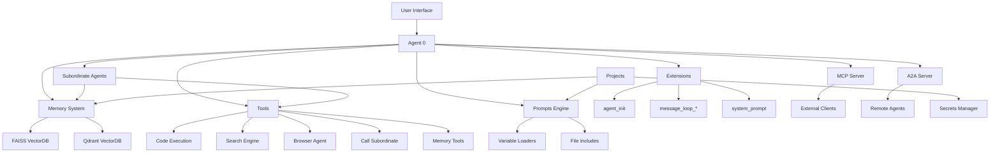

<!-- OPENSPEC:START -->
# OpenSpec Instructions

These instructions are for AI assistants working in this project.

Always open `@/openspec/AGENTS.md` when the request:
- Mentions planning or proposals (words like proposal, spec, change, plan)
- Introduces new capabilities, breaking changes, architecture shifts, or big performance/security work
- Sounds ambiguous and you need the authoritative spec before coding

Use `@/openspec/AGENTS.md` to learn:
- How to create and apply change proposals
- Spec format and conventions
- Project structure and guidelines

Keep this managed block so 'openspec update' can refresh the instructions.

<!-- OPENSPEC:END -->

# AGENTS.md
This file provides guidance to Verdent when working with code in this repository.

## Table of Contents
1. [Commonly Used Commands](#commands)
2. [High-Level Architecture & Structure](#architecture)
3. [Key Rules & Constraints](#key-rules--constraints)
4. [Development Hints](#development-hints)

## Commands

### Docker Runtime
```bash
# Pull and run Agent Zero
docker pull agent0ai/agent-zero
docker run -p 50001:80 agent0ai/agent-zero

# Hacking edition (Kali-based)
docker pull agent0ai/agent-zero:hacking
docker run -p 50001:80 agent0ai/agent-zero:hacking

# With volume mapping (use backup/restore instead - see docs)
docker run -p 50001:80 -v /path/to/data:/a0 agent0ai/agent-zero
```

### Development Setup
```bash
# Install dependencies
pip install -r requirements.txt
playwright install chromium

# Run locally (Web UI)
python run_ui.py
python run_ui.py --port=5555

# Run locally (CLI)
python run_cli.py
```

### Testing
```bash
# Run specific tests [inferred - test files exist]
python -m pytest tests/chunk_parser_test.py
python -m pytest tests/rate_limiter_test.py
python tests/test_fasta2a_client.py
```

### Build Docker Image
```bash
# Build from local Dockerfile
docker build -f DockerfileLocal -t agent-zero-local \
  --build-arg CACHE_DATE=$(date +%Y-%m-%d:%H:%M:%S) .
```

### Qdrant Memory Backend
```bash
# Start Qdrant container
cd docker/run
docker compose -f docker-compose.qdrant.yml up -d

# Verify Qdrant is running
curl http://localhost:6333/health
```

---

## Architecture

### Major Subsystems

#### 1. Agent Hierarchy System
- **Agent 0**: Top-level agent interfacing with user
- **Subordinate Agents**: Created dynamically to handle subtasks
- **Communication**: Messages flow up/down hierarchy via `call_subordinate` tool
- **Context Isolation**: Each agent maintains clean context via message history management

#### 2. Tools System
- **Built-in Tools**: `python/tools/` - response, code_execution, memory_*, search_engine, browser_agent, call_subordinate, etc.
- **Dynamic Discovery**: Tools auto-loaded from folder structure
- **Agent-Specific Override**: `/agents/{profile}/tools/` overrides default tools
- **Execution Lifecycle**: `before_execution` → `execute` → `after_execution`

#### 3. Memory System
- **Backends**: FAISS (default), Qdrant, Hybrid
- **Vector Store**: Embeddings via LiteLLM (configurable model)
- **Areas**: main, fragments, solutions, instruments
- **Automatic Summarization**: Context window optimization via message compression
- **Project Isolation**: Per-project memory via `projects/{name}` subdirs

#### 4. Extensions Framework
- **Extension Points**: `agent_init`, `message_loop_start/end`, `system_prompt`, `monologue_start/end`, etc.
- **Alphabetical Execution**: Files sorted by name (use `_10_`, `_50_` prefixes)
- **Override Pattern**: Agent-specific extensions in `/agents/{profile}/extensions/`
- **Example**: `_10_initial_message.py` sets agent's first message

#### 5. Prompts Engine
- **Main Prompt**: `prompts/agent.system.main.md` includes sub-prompts
- **Variable Placeholders**: `{{var}}` replaced at runtime
- **Dynamic Loaders**: Companion `.py` files generate variables (e.g., `agent.system.tools.py`)
- **File Includes**: `{{ include "path/to/file.md" }}` for modularity
- **Agent Overrides**: `/agents/{profile}/prompts/` overrides defaults

#### 6. Projects System
- **Location**: `/a0/usr/projects/{name}/.a0proj/`
- **Isolated Workspaces**: Own prompts, memory, knowledge, files, secrets
- **Auto-Injection**: Instructions from `.a0proj/instructions/` added to context
- **Secrets**: `.a0proj/secrets.env` (sensitive), `.a0proj/variables.env` (non-sensitive)

### Key Data Flows

```
User Input
  ↓
Agent 0 (context initialization)
  ↓
VectorDB Memory Recall (semantic search)
  ↓
System Prompt Construction (prompts + extensions + tools)
  ↓
LLM Call (via LiteLLM)
  ↓
Tool Execution (code_execution, search, memory_save, call_subordinate)
  ↓
Subordinate Agent (if needed)
  ↓
Response Tool (final answer)
  ↓
Memory Storage (fragments, solutions)
  ↓
User Output
```

### Development Entry Points

- **`run_ui.py`**: Flask-based Web UI + API server (port 50001 default)
- **`run_cli.py`**: Terminal interface with streaming output
- **`agent.py`**: Core `Agent` and `AgentContext` classes
- **`initialize.py`**: Framework initialization (chats, MCP, preload)
- **`models.py`**: LLM provider configuration

### External Dependencies

- **Docker**: Runtime environment (Dockerized by default)
- **SearXNG**: Privacy-focused metasearch engine (built into Docker image)
- **LiteLLM**: Unified LLM provider interface (OpenAI, Anthropic, OpenRouter, etc.)
- **FastMCP**: MCP protocol server implementation
- **FastA2A**: Agent-to-Agent protocol server
- **Qdrant**: Optional vector database (alternative to FAISS)
- **Playwright**: Browser automation for browser_agent tool

### Subsystem Relationships



---

## Key Rules & Constraints

### Runtime Architecture

- **Docker-First**: Primary deployment is via Docker container; local development requires RFC (Remote Function Calling) configuration
- **Port Mapping**: Default Web UI on port 80 (container) → map to host port (e.g., 50001)
- **Data Persistence**: Use built-in backup/restore system instead of volume mapping `/a0` (avoids upgrade conflicts)
- **SSH Port**: Container exposes SSH on port 22 for RFC communication during development

### Extension System

- **Execution Order**: Extensions run alphabetically; use numbered prefixes (`_10_`, `_20_`, `_50_`, `_90_`) to control sequence
- **Override Pattern**: Agent-specific extensions in `/agents/{profile}/extensions/{point}/` completely replace default versions with same filename
- **Extension Points**: `agent_init`, `before_main_llm_call`, `message_loop_start`, `message_loop_prompts_before`, `message_loop_prompts_after`, `message_loop_end`, `monologue_start`, `monologue_end`, `reasoning_stream`, `response_stream`, `system_prompt`, etc.
- **Base Class**: All extensions inherit from `Extension` and implement `async execute(**kwargs)`

### Tool Development

- **Token Economy**: System prompt includes all tool descriptions → keep tools minimal
- **Instruments Over Tools**: For custom functions, use Instruments (stored in long-term memory, recalled on-demand) instead of adding Tools
- **Tool Structure**: Inherit from `Tool` base class; implement `execute(**kwargs)` returning `Response`
- **Location**: `/python/tools/{tool_name}.py` + `/prompts/agent.system.tool.{tool_name}.md`
- **Registration**: Add reference in `prompts/agent.system.tools.md`

### Prompt System

- **Variable Syntax**: `{{variable_name}}` replaced at runtime
- **Dynamic Variables**: Create companion `.py` file (e.g., `agent.system.tools.py`) with `VariablesPlugin` class
- **Includes**: `{{ include "relative/path.md" }}` for modular composition
- **Fallback Chain**: Agent-specific prompts → default prompts
- **Behavior Files**: Stored in memory as `behaviour.md`, automatically merged into system prompt

### Security

- **Secret Masking**: Extensions `tool_execute_before/_10_unmask_secrets.py` and `tool_execute_after/_10_mask_secrets.py` handle secret injection/removal
- **Projects Secrets**: Use `.a0proj/secrets.env` for scoped credentials (never commit to repo)
- **API Keys**: Store in `.env` file (never commit); access via `dotenv.get_dotenv_value()`
- **MCP Authentication**: Token-based; token auto-generated from auth credentials in settings

### Memory System

- **Automatic Summarization**: Messages compressed progressively to fit context window; older messages summarized more aggressively
- **Areas**: `main` (general knowledge), `fragments` (auto-saved conversation snippets), `solutions` (successful problem resolutions), `instruments` (tool descriptions)
- **Backends**: FAISS (default, local files), Qdrant (scalable, requires container), Hybrid (Qdrant + FAISS fallback)
- **Collection Naming**: Qdrant collections follow `{base_collection}-{memory_subdir}` pattern for isolation

### Projects

- **Location**: `/a0/usr/projects/{name}/.a0proj/`
- **Isolation**: Each project has own memory, knowledge, prompts (instructions), secrets, variables
- **Auto-Injection**: All `.txt` files in `.a0proj/instructions/` added to system prompt when project active
- **Working Directory**: Agent works inside `/a0/usr/projects/{name}/` when project active
- **Backup**: Copy entire project directory or use built-in backup system

---

## Development Hints

### Adding a New Tool

1. **Create tool class** in `python/tools/{tool_name}.py`:
   ```python
   from python.helpers.tool import Tool, Response
   
   class MyTool(Tool):
       async def execute(self, **kwargs):
           # Access arguments: self.args["param_name"]
           result = do_something(self.args["input"])
           return Response(message=result, break_loop=False)
   ```

2. **Create prompt template** `prompts/agent.system.tool.{tool_name}.md`:
   ```markdown
   # Tool: my_tool
   
   **Description**: What this tool does
   
   **Arguments**:
   - `input` (string, required): Description
   - `option` (boolean, optional): Description
   
   **Example**:
   {
     "thoughts": "I need to use my_tool",
     "tool_name": "my_tool",
     "tool_args": {
       "input": "test value"
     }
   }
   ```

3. **Register in tools list** by adding to `prompts/agent.system.tools.md`:
   ```markdown
   {{ include "agent.system.tool.my_tool.md" }}
   ```

4. **Agent-specific tool**: For subordinate agent customization:
   - Place in `/agents/{profile}/tools/{tool_name}.py`
   - Prompt in `/agents/{profile}/prompts/agent.system.tool.{tool_name}.md`

### Creating an Extension

1. **Choose extension point**: `agent_init`, `message_loop_end`, `system_prompt`, etc.

2. **Create extension file** in `python/extensions/{extension_point}/_NN_{name}.py`:
   ```python
   from python.helpers.extension import Extension
   
   class MyExtension(Extension):
       async def execute(self, **kwargs):
           # Access agent: self.agent
           # Modify behavior
           self.agent.data["custom_flag"] = True
   ```

3. **Number prefix**: Use `_10_` for early execution, `_90_` for late
   - Memory extensions: `_50_memorize_fragments.py`, `_51_memorize_solutions.py`
   - System prompt: `_10_system_prompt.py`, `_20_behaviour_prompt.py`

4. **Agent-specific override**: Place in `/agents/{profile}/extensions/{point}/_NN_{name}.py`

### Adding an API Endpoint

1. **Create handler** in `python/api/{endpoint_name}.py`:
   ```python
   from python.helpers.api import ApiHandler
   from werkzeug.wrappers.response import Response
   
   class MyEndpoint(ApiHandler):
       @staticmethod
       def get_methods():
           return ["POST"]
       
       @staticmethod
       def requires_auth():
           return True
       
       @staticmethod
       def requires_csrf():
           return True
       
       async def handle_request(self, request):
           data = await request.get_json()
           result = {"status": "ok"}
           return Response(json.dumps(result), mimetype="application/json")
   ```

2. **Auto-registration**: Endpoint automatically available at `/{endpoint_name}`
   - Handlers loaded from `python/api/` via `extract_tools.load_classes_from_folder()`

### Setting Up RFC for Development

Remote Function Calling allows local development instance to use Dockerized environment for code execution.

1. **Run Dockerized instance**:
   ```bash
   docker run -p 8880:80 -p 8822:22 -v /local/path:/a0 agent0ai/agent-zero
   ```

2. **Configure RFC password** in Dockerized instance:
   - WebUI → Settings → Development → RFC Password: `your_password`
   - Save settings

3. **Configure local instance**:
   - WebUI → Settings → Development:
     - RFC Password: `your_password`
     - SSH Port: `8822`
     - HTTP Port: `8880`
     - RFC Destination URL: `localhost`
   - Save settings

4. **Test connection**: Ask agent to execute terminal command (e.g., "Get current OS version")
   - Should return Dockerized environment info (e.g., "Kali GNU/Linux Rolling")

### MCP Server Integration

Agent Zero can consume external MCP servers as tools.

1. **Configure in Settings** → MCP Servers or edit `tmp/settings.json`:
   ```json
   {
     "mcp_servers": "[
       {
         \"name\": \"my_server\",
         \"type\": \"stdio\",
         \"command\": \"npx\",
         \"args\": [\"-y\", \"@package/mcp-server\"],
         \"disabled\": false
       }
     ]"
   }
   ```

2. **Server types**:
   - **stdio**: Local process communication (`command` + `args`)
   - **sse**: Remote Server-Sent Events (`url` + optional `headers`)
   - **streaming-http**: HTTP-based streaming (`url` + optional `headers`)

3. **Tool naming**: Tools auto-prefixed with server name: `{server_name}.{tool_name}`

4. **Initialization**: MCP tools discovered and injected into system prompt automatically

### Using Qdrant Memory Backend

1. **Start Qdrant container**:
   ```bash
   cd docker/run
   docker compose -f docker-compose.qdrant.yml up -d
   ```

2. **Configure memory backend** in `conf/memory.yaml`:
   ```yaml
   backend: qdrant  # or 'hybrid' for Qdrant + FAISS fallback
   
   qdrant:
     url: http://localhost:6333
     api_key: ""
     collection: agent-zero
     prefer_hybrid: true
     score_threshold: 0.6
     limit: 20
     timeout: 10
   ```

3. **Restart Agent Zero**: Memory operations now use Qdrant

4. **Hybrid mode** (`backend: hybrid`):
   - Writes to Qdrant
   - Falls back to FAISS on errors
   - Good for gradual migration

### Accessing Qdrant via MCP

Agent Zero exposes Qdrant memory operations via MCP server.

1. **Enable MCP server**: Settings → External Services → Enable MCP Server

2. **Get API token**: Settings → External Services → Copy token

3. **Configure MCP client** (e.g., Claude Desktop):
   ```json
   {
     "mcpServers": {
       "agent-zero-memory": {
         "type": "sse",
         "url": "http://localhost:50001/mcp/t-YOUR_TOKEN/sse"
       }
     }
   }
   ```

4. **Available tools**:
   - `search_memories(query, memory_subdir, limit, threshold, filter)`
   - `insert_memory(text, metadata, memory_subdir)`
   - `delete_memories_by_query(query, threshold, filter, memory_subdir)`
   - `delete_memories_by_ids(ids, memory_subdir)`
   - `get_memory_by_id(id, memory_subdir)`
   - `list_memory_collections()`
   - `get_collection_info(memory_subdir)`

5. **See docs**: `docs/mcp_qdrant.md` for detailed tool reference

### Creating a Project

1. **Create via WebUI**: Projects section → New Project → Name: `myproject`

2. **Add instructions** to `.a0proj/instructions/`:
   ```bash
   # Inside container or via File Browser
   echo "Always use TypeScript for this project" > \
     /a0/usr/projects/myproject/.a0proj/instructions/typescript.txt
   ```

3. **Add knowledge** to `.a0proj/knowledge/`:
   - Files imported into project-specific memory
   - Supports `.txt`, `.pdf`, `.csv`, `.html`, `.json`, `.md`

4. **Add secrets** to `.a0proj/secrets.env`:
   ```bash
   API_KEY=secret_value_here
   DATABASE_URL=postgresql://...
   ```

5. **Activate project**: Select project in WebUI before starting chat
   - Agent works inside `/a0/usr/projects/myproject/`
   - Instructions auto-injected into context
   - Memory isolated to `projects/myproject` collection

### Extending Subordinate Agents

Create specialized agents with custom behavior.

1. **Create agent profile** directory:
   ```bash
   mkdir -p /agents/data_analyst/{tools,prompts,extensions}
   ```

2. **Override prompts** in `/agents/data_analyst/prompts/agent.system.main.role.md`:
   ```markdown
   ## Your role
   You are a specialized data analyst agent. You excel at:
   - Statistical analysis using Python (pandas, numpy, scipy)
   - Data visualization with matplotlib and seaborn
   - Interpreting results and providing insights
   ```

3. **Add custom tool** in `/agents/data_analyst/tools/plot_data.py`:
   ```python
   from python.helpers.tool import Tool, Response
   
   class PlotDataTool(Tool):
       async def execute(self, **kwargs):
           # Custom plotting logic
           return Response(message="Plot created", break_loop=False)
   ```

4. **Settings override** in `/agents/data_analyst/settings.json`:
   ```json
   {
     "chat_model": {
       "provider": "openrouter",
       "name": "anthropic/claude-3.5-sonnet"
     }
   }
   ```

5. **Use in calls**: 
   ```json
   {
     "tool_name": "call_subordinate",
     "tool_args": {
       "message": "Analyze this dataset",
       "subordinate_agent_profile": "data_analyst"
     }
   }
   ```
